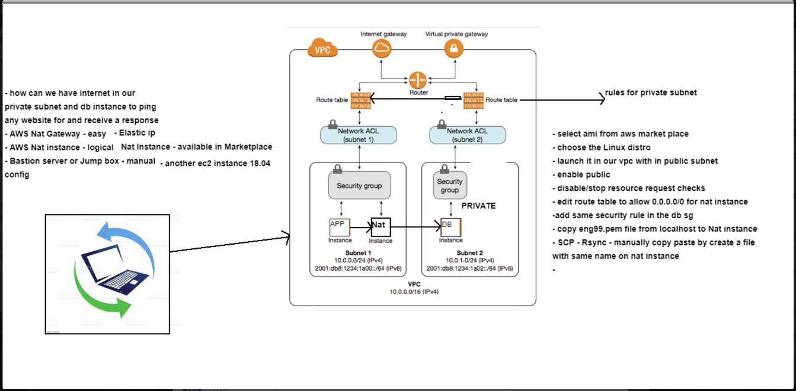

# VPC
https://github.com/brittanyharrison/aws_VPC/blob/main/README.md
## what is a CIDR Block
- Classless Inter-Domain Routing (CIDR) block basically is a method for allocating IP addresses and IP routing
- Eg. 10.0.0.0/24 means
## what is ipv4 and ipv6
- The Internet Protocol version 4 (IPv4) is a protocol for use on packet-switched Link Layer networks (e.g. Ethernet). ... The Internet Protocol version 6 (IPv6) is more advanced and has better features compared to IPv4. It has the capability to provide an infinite number of addresses
- The IPv4 is a 32-bit address, whereas IPv6 is a 128-bit hexadecimal address.
- Switching from IPv4 to IPv6 will give the Internet a much larger pool of IP addresses
- An IPv6 address is represented as eight groups of four hexadecimal digits, each group representing 16 bits The groups are separated by colons (:)
- An example of an IPv6 address is: 2001:0db8:85a3:0000:0000:8a2e:0370:7334. 
-  For example, 192.0. 2.146 is a valid IPv4 address.

##  what is route table
- A route table contains a set of rules, called routes, that are used to determine where network traffic from your subnet or gateway is directed. To put it simply, a route table tells network packets which way they need to go to get to their destination.

## what is a internet gateway
- An internet gateway is a horizontally scaled, redundant, and highly available VPC component that allows communication between your VPC and the internet.
> An internet gateway serves two purposes:
- to provide a target in your VPC route tables for internet-routable traffic
- to perform network address translation (NAT) for instances that have been assigned public IPv4 addresses
- An internet gateway supports IPv4 and IPv6 traffic. It does not cause availability risks or bandwidth constraints on your network traffic. There's no additional charge for having an internet gateway in your account.

## VPC and subnets
- Amazon Virtual Private Cloud (Amazon VPC) enables you to launch AWS resources into a virtual network that you've defined. This virtual network closely resembles a traditional network that you'd operate in your own data center, with the benefits of using the scalable infrastructure of AWS.
- Virtual private cloud (VPC) — A virtual network dedicated to your AWS account.
- Subnet — A range of IP addresses in your VPC.
- Route table — A set of rules, called routes, that are used to determine where network traffic is directed.
- Internet gateway — A gateway that you attach to your VPC to enable communication between resources in your VPC and the internet.
- A virtual private cloud (VPC) is a virtual network dedicated to your AWS account. It is logically isolated from other virtual networks in the AWS Cloud. You can launch your AWS resources, such as Amazon EC2 instances, into your VPC.

- When you create a VPC, you must specify a range of IPv4 addresses for the VPC in the form of a Classless Inter-Domain Routing (CIDR) block; for example, 10.0.0.0/16. This is the primary CIDR block for your VPC. For more information about CIDR notation, see RFC 4632.

- A VPC spans all of the Availability Zones in the Region
> subnets
- A subnet is a range of IP addresses in your VPC. You can launch AWS resources, such as EC2 instances, into a specific subnet
- When you create a subnet, you specify the IPv4 CIDR block for the subnet, which is a subset of the VPC CIDR block
- Each subnet must reside entirely within one Availability Zone and cannot span zones
- By launching instances in separate Availability Zones, you can protect your applications from the failure of a single zone.
## what is NACL
- An optional layer of security that acts as a firewall for controlling traffic in and out of a subnet. You can associate multiple subnets with a single network ACL, but a subnet can be associated with only one network ACL at a time.
## difference between statefull and stateless
- Security group is the firewall of EC2 Instances.
- Network ACL is the firewall of the VPC Subnets
- Security groups are tied to an instance whereas Network ACLs are tied to the subnet.
- Security groups are stateful: This means any changes applied to an incoming rule will be automatically applied to the outgoing rule. e.g. If you allow an incoming port 80, the outgoing port 80 will be automatically opened.
- Network ACLs are stateless: This means any changes applied to an incoming rule will not be applied to the outgoing rule. e.g. If you allow an incoming port 80, you would also need to apply the rule for outgoing traffic.
> Rules: Allow or Deny
- Security group support allow rules only (by default all rules are denied). e.g. You cannot deny a certain IP address from establishing a connection.
- Network ACL support allow and deny rules. By deny rules, you could explicitly deny a certain IP address to establish a connection example: Block IP address 123.201.57.39 from establishing a connection to an EC2 Instance.
 ## VPC Diagram

 # DAY 14 (practical)
 -  step1: create a vpc
 -  step2: Internet Gateway(IG)
 -     2.1 - attach the IG with our VPC
 - step3: pubic subnet for our app
 - step4: create routing table(RT) with route/rule
 -          4.1 Edit routes to allow IG and VPC(edit routes)
 -          4.2 associate our RT to our public subnet(edit subnet association)
 - Create a security group or create when we launch our app(public subnets)
 -      port 22:from my ip only
 -      port 3000
 -      port 80 HTTP
 -      HTTP- SSL

# complete app and db deployment(db no intenet)

- create 2 subnets(public,private)
- set the SG of ec2's in private to not allow to allowed access from internet
- create a NACL for db allowing all traffic from and to app_subnet(and atach it to db subnet)
> Detailed:
-       create a vpc wth cidr 10.0.0.0/16
-       create a subnet: cidr 10.0.13.0/24 and set nacl to allow all traffic from source =0.0.0.0/0 (set both inbound and outbound)
-       Security group for app: 1)ssh from my ip,2)custom tcp to port 3000 from 0.0.0.0/0, 3) http frm 0.0.0.0/0
-       create a subnet: cidr 10.0.14.0/24 and set nacl to allow all traffic from 10.0.13.0/24(ip of app_subnet) set both inbound and outbound
-       SG for db: custom Tcp from 10.0.13.0/24(ip of app subnet) to port 27017
-       ssh into app
-       environment variable:"sudo nano .bashrc" DB_HOST:"mongodb://10.0.14.171:27017/posts" where '10.0.14.171' is the PRIVATE IP of db "source ~/.bashrc"
-       set up reverse proxy "sudo nano /etc/nginx/sites-available/default"->"sudo nginx -t"->"sudo systemctl restart nginx"
-       run it
# set up internet for database in private subnet(so that we can update):
## using NAT:
-       launch an nat instance(ami should be a nat) into the public subnet of the vpc
-       update the routing table of private subnet to 'vpcadress:local' and also '0.0.0.0/0:instace(nat)'
-       sg of both nat  add 'icmp-all-0.0.0.0/0' 'tcp-22-0.0.0.0/0' 'tcp-80-0.0.0.0/0'
-       sg for db 'icmp-all-ip_of_publicsubnet', 'ssh-ip_of_publicsubnet', '' 

# heading
## h2
### h3
#### h4
**bold*
> note
- bullet point
-