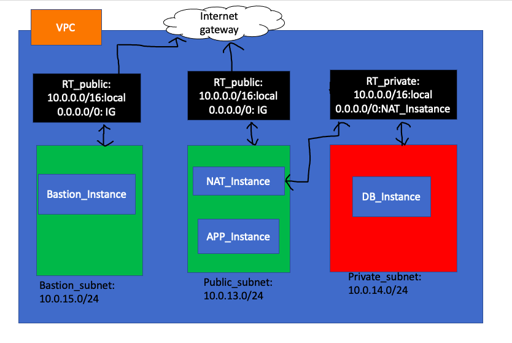
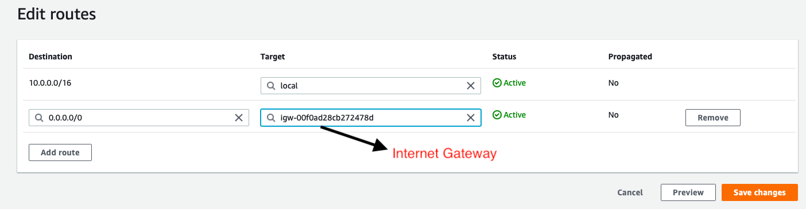
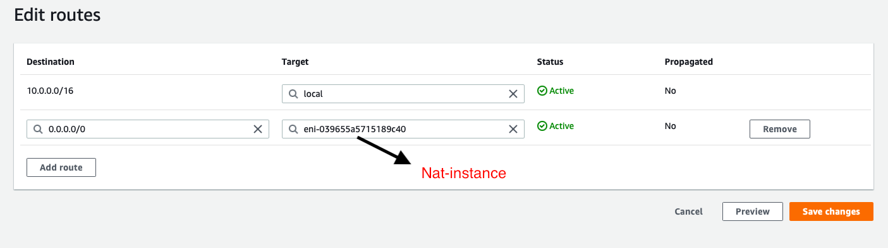
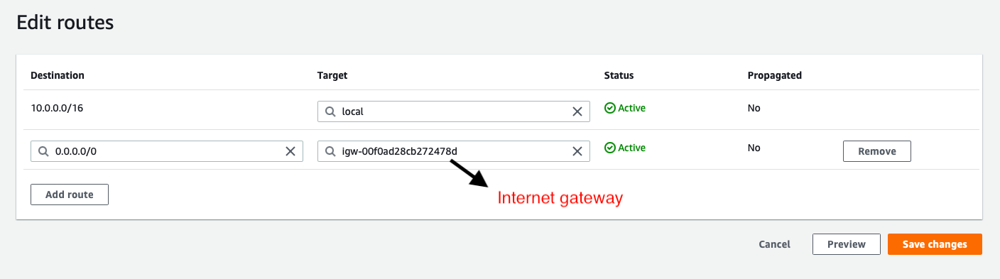
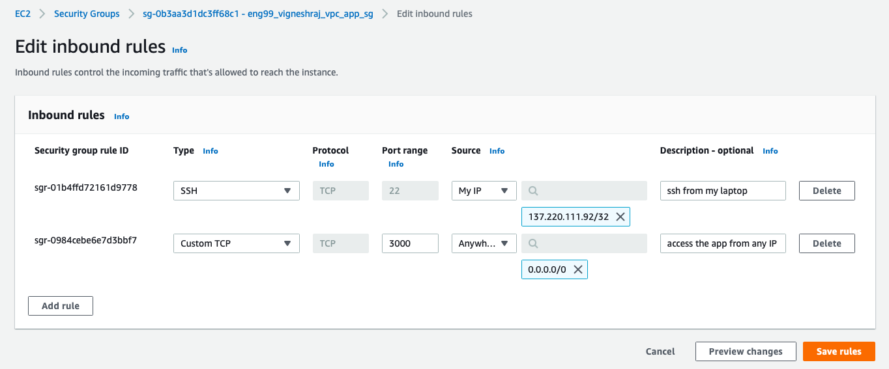
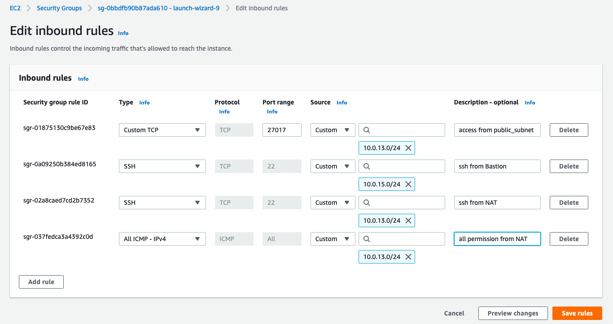
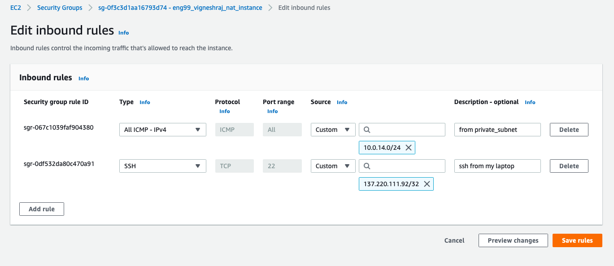
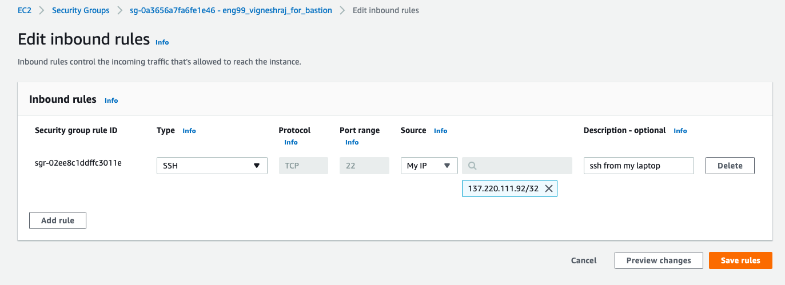

# aws netowrking
## vpc
### 2 tier architecture deployment

**aws networking**
- ip adress
        VPC : 10.0.0.0/16
        subnet_public: 10.0.13.0/24
        subnet_private: 10.0.14.0/24
        subnet_bastion: 10.0.15.0/24
- cidr block
- ipv4 and ipv6

# vpc and its resorces

## route table
      
**Public_subnet(app & NAT)**:
-        1) '10.0.0.0/16:local' for all resources inside vpc to communicate with each other
-        2) '0.0.0.0/0:IG' to connect to internetgateway for internet

**Private_subnet(DB )**:
-        1) '10.0.0.0/16:local' for all resources inside vpc to communicate with each other
-        2) '0.0.0.0/0:NAT_Instance' to connect to nat_instance to be able to access internet inside db indirectly

**Bastion_subnet(Bastion)**:
-        1) '10.0.0.0/16:local' for all resources inside vpc to communicate with each other
-        2) '0.0.0.0/0:IG' to connect to internetgateway for internet

## SG rules
**APP Instance:**
-       1)SSH: MY_IP
-       2)Custom TCP(port 3000):Any_ip(0.0.0.0/0)

**DB Instance:**
  
 
**NAT Instance**

**Bastion Instance**

## subnet cidr blocks
-       entire VPC: 10.0.0.0/16
-       public_subnet: 10.0.13.0/24
-       private_subnet: 10.0.14.0/24
-       bastion_subnet: 10.0.15.0/24
- connectivity betweenD1: app and db,D2: app nat db

**2 tier architecyure deployment in our own apc**

- should have all rules at all levels required